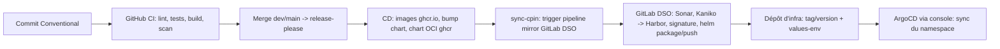

# De un commit à un environnement CPiN

Reconstitué à partir de `ocr-api` (`cd.yml`, `dso-auto-sync.yaml`, `.gitlab-ci-dso.yml`) et de la documentation CPiN (`services/gitops.md`, `guide/deployment-with-argo.md`).
Ce qui n'est pas visible dans ces sources est signalé.

## Étapes et acteurs

| # | Étape | Acteur | Détail |
|---|---|---|---|
| 1 | CI de PR | GitHub Actions (fabnum-cicd) | lint-commits, gitleaks, trivy config, lint-helm, build image `pr-N`, scan, gate `all-jobs-passed` |
| 2 | Release | `release-app` (release-please) | PR de release ouverte/maj à chaque push ; le merge crée le tag et `release-created=true` |
| 3 | Images | `build-docker` | tag = version (`0.20.2`, `0.21.0-rc.1`), `latest` seulement sur `main` |
| 4 | Chart | `update-helm-chart` (mode `local`) puis `release-helm-local` | bump `appVersion`/`version` puis publication OCI sur ghcr.io |
| 5 | Synchro | `sync-cpin` | POST sur l'API trigger du projet `mirror` du GitLab interne (`GIT_BRANCH_DEPLOY`, `PROJECT_NAME`) |
| 6 | Chaîne DSO | GitLab CI (`.gitlab-ci-dso.yml`) | `read-secret` (Vault), analyse Sonar, Kaniko build+push Harbor (tags : SHA court, branche, appVersion, `latest` si semver stable), `helm-package-push` en OCI Harbor |
| 7 | Déploiement | ArgoCD (créé par la console) | déploie le dépôt d'infra (Helm/Kustomize/manifests) avec `values-<env>.yaml` |

## Points de rupture connus
- `sync-cpin` doit s'exécuter **après** le commit de bump du chart, sinon GitLab voit l'ancien état (dans ocr-api il attend `release` et `bump-chart`, pas `build-docker`).
- L'image déployée est celle de **Harbor** (reconstruite par Kaniko), pas celle de ghcr.io. La CI GitHub sert de contrôle amont et de source du chart.
- Tag d'image inchangé ⇒ aucun diff pour ArgoCD ⇒ pas de redéploiement.
- Les éditions faites dans l'interface ArgoCD sont ignorées (config pilotée par la console).
- **Non visible dans les sources lues** : l'étape qui met à jour la version de chart/tag par environnement (le commentaire de `cd.yml` évoque un dépôt de values séparé, `mirai-values`).

## Variante documentée par CPiN
La doc CPiN propose d'utiliser `CI_COMMIT_SHORT_SHA` comme tag d'image, de modifier automatiquement la référence d'image (Kustomize/values) dans le dépôt d'infra,
et de déclencher la synchro par un trigger depuis la chaîne primaire (GitHub Action ou GitLab CI).
